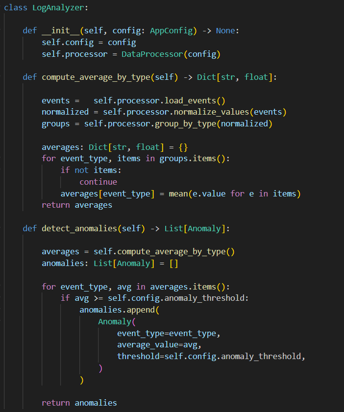
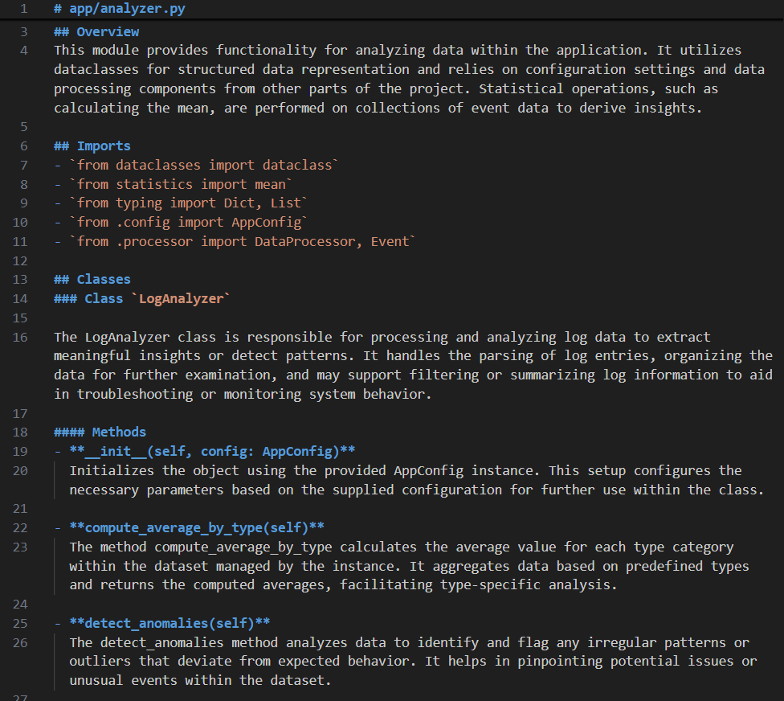

# AI Documentation Generator

System that automatically generates structured software documentation from source code by combining code parsing and LLM-based generation.

---

## Problem

Software documentation is often outdated or missing, making it difficult for developers to understand systems.  
Generating useful documentation automatically is challenging because raw code alone does not provide enough structured context for reliable AI outputs.

---

## Solution

This project builds a pipeline that analyzes source code, extracts structured information, and uses LLMs to generate consistent documentation.

Instead of sending raw code to the model, the system first parses and structures relevant components, improving output quality and reducing noise.

---

## Architecture

The system is organized into modular components:

- **Code Parser**  
  Uses Tree-Sitter to extract structured elements (functions, classes, signatures)

- **Context Builder**  
  Transforms parsed data into structured inputs for the LLM

- **LLM Adapter**  
  Abstraction layer to interact with OpenAI models

- **Documentation Generator**  
  Produces structured Markdown output

### Data Flow

1. Parse source code using Tree-Sitter
2. Extract structured elements (functions, classes)
3. Build structured context for the LLM
4. Generate documentation via OpenAI API
5. Format output into Markdown

---

## Key Challenges

- **Context structuring**  
  Raw code leads to poor outputs → solved by parsing + structured inputs

- **Output consistency**  
  Ensuring documentation follows a predictable format

- **Scalability**  
  Handling multiple files and maintaining context across them

---

## Trade-offs

- More preprocessing → better quality, but higher complexity  
- Smaller context → faster, but less complete documentation  
- Simpler prompts → easier to maintain, but less expressive  

---

## Example

### Input (Python function)

### Generated Documentation

---

## Usage

pip install -r requirements.txt
python main.py --project-path /path/to/codebase

---

## Tech Stack

- Python
- Tree-Sitter (code parsing)
- OpenAI API (LLM generation)
- JSON / Markdown

---

## Limitations

- Currently supports Python only  
- No automated evaluation of output quality  
- Not yet optimized for large codebases  

---

## Future Improvements

- Multi-file context handling  
- Output evaluation metrics  
- Support for additional languages  

---

## Author

Franco Martelletti
